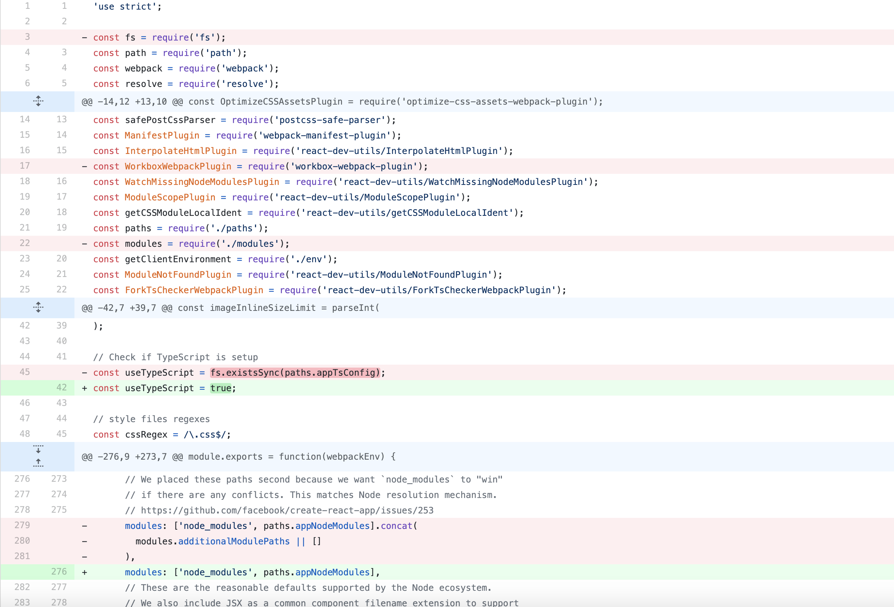
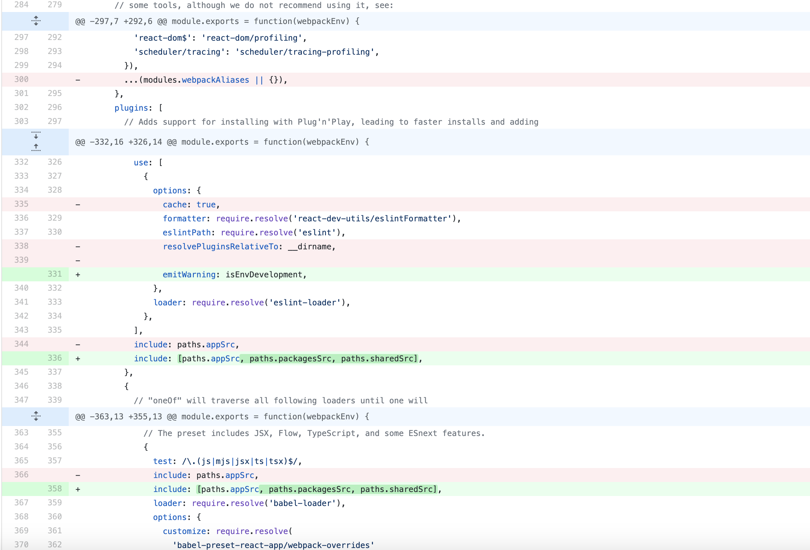
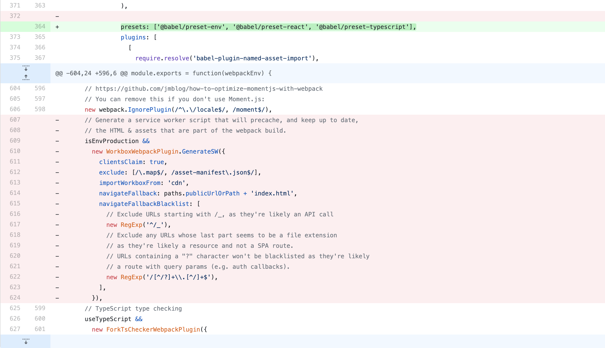

# Example monorepo for Yarn Workspaces and Lerna

This is an example monorepo setup in Typescript using Yarn Workspaces and Lerna.

It builds off of some painful experiences to hopefully provide some best practices when building your own monorepo :)

## Best Practices

-   GitHub `CODEOWNERS` file to require PR approval before merging if modifying a package
-   GitHub CI/CD status checks (running `build`, `lint`, `test`, `typecheck`, etc)
-   force workspace packages to declare dependencies in `package.json` so can understand dependency tree
-   do not allow circular dependencies (ie: `packages/package1` dependes on `packages/package2` and `packages/package2` depends on `/packages/package1`)
-   run CI/CD on affected code and dependents only (ie: `lerna run test --since origin/master --include-dependents`)
-   make packages follow common repo tooling (ie: `lerna exec -- eslint . --ext .js,.jsx,.ts,.tsx`)
-   delegate to packages for tooling that you want packages to own (ie: `lerna run test|<any script in package.json>`)
-   enforce packages to share common structure (`packages/package1/src` and `packages/package1/test`)
-   strict settings per package by default but allow overrides (ie: code coverage rules, tsconfig settings, eslint settings)
-   enforce stricter standards on `/shared` packages
-   need a way to ensure key dependency versions are resolved only once like `react`, `react-router-dom`, etc. (ie: use `peerDependencies`, babel resolution, or monitoring `yarn.lock` or `package.json`s via lint settings)
-   use `^` when choosing package versions, so can resolve minor versions to the highest one in common

## Harder to enforce Best Practices

-   share code over duplicating
-   isolate infrastructure and ownership when sharing code (bonus if can isolate CI/CD)
-   share patterns when matured
-   avoid copy and pasting bad code
-   share language and terminology (ie: `/shared` is known to be non-web/mobile specific. `/web` and `/mobile` are not to be imported from)

## Common pain points

-   long CI/CD PR status checks
-   unfamiliar developers committing code that does not follow standards of repo
-   shared dependency conflicts and resolution (ie: `"react": "15.1.0"` in `/app/package.json` but `"react": "16.1.0"` in `/shared/package.json`)
-   bugs and coupling caused by circular dependencies leads to runtime errors
-   lack of quality / consistency due to non-strict settings / no tests / no status checks
-   manual `webpack.config.js` / `metro.config.js` modifications normally required

## Getting started with a fresh repo

### Let's work towards this folder structure

```
package.json
lerna.json
tsconfig.json
/apps
  /react-app
    /app
      /src
      /test
      package.json
      tsconfig.json
    /packages
      /routes
        /src
        /test
        package.json
        tsconfig.json
/shared
  /packages
    /theme
      /src
      /test
      package.json
      tsconfig.json
```

#### Create base package.json with Yarn workspaces and Lerna setup

Create package.json file:

```json
{
    "name": "yarn-workspace-lerna-monorepo",
    "version": "1.0.0",
    "repository": "https://github.com/bryan-hunter/yarn-workspace-lerna-monorepo",
    "private": true,
    "workspaces": ["shared/**", "apps/**"],
    "scripts": {},
    "devDependencies": {},
    "dependencies": {}
}
```

Add lerna and create lerna.json file:

```bash
yarn add lerna -D -W
```

```json
{
    "packages": ["shared/**", "apps/**"],
    "version": "independent",
    "npmClient": "yarn",
    "useWorkspaces": true
}
```

#### Run Create React App to generate /apps/react-app/app folder

```bash
npx create-react-app apps/react-app/app --template typescript
```

-   `eject` the app
-   remove node_modules and yarn.lock and .gitignore
-   rearrange rest of folder to look like [see: apps/react-app/app](./apps/react-app/app)
-   remove files and dependencies related to `jest` and `eslint` - those will be managed at the root of the repo

#### The hard part - modifying your webpack.config.js

-   remove `modues.js` file (we will not be using a non-standard `tsconfig.json` so we won't need this)
-   update the paths in `paths.js`: These help map our files and workspaces that we need to resolve with `webpack`

```js
module.exports = {
    dotenv: resolveApp('.env'),
    appPath: resolveApp('.'),
    appBuild: resolveApp('build'),
    appPublic: resolveApp('public'),
    appHtml: resolveApp('public/index.html'),
    appIndexJs: resolveModule(resolveApp, 'src/index'),
    appPackageJson: resolveApp('package.json'),
    appSrc: resolveApp('src'),
    appNodeModules: resolveApp('node_modules'),
    publicUrlOrPath,
    packagesSrc: resolveApp('../packages'),
    sharedSrc: resolveApp('../../../shared/packages'),
};
```

-   update `webpack.config.js`
    
    
    
-   modify `scripts/build.js` and `scripts/start.js`

```js
const useYarn = true; // so we don't have to search for `yarn.lock` file
```

#### Set up 'routes' package and shared 'theme' package

-   Create 'routes' Package for react-app [see: apps/react-app/packages/routes](./apps/react-app/packages/routes)
-   Create shared 'theme' Package [see: shared/packages/theme](./shared/packages/theme)

#### Let's set up our root dependencies and package.json

-   navigate to root of the repo

##### Typescript

```bash
yarn add typescript -D -W
```

`tsconfig.json`

```json
{
    "compilerOptions": {
        "target": "es5",
        "lib": ["dom", "dom.iterable", "esnext"],
        "allowJs": true,
        "strict": true,
        "noImplicitAny": true,
        "strictNullChecks": true,
        "strictFunctionTypes": true,
        "strictBindCallApply": true,
        "strictPropertyInitialization": true,
        "noImplicitThis": true,
        "noUnusedLocals": true,
        "noUnusedParameters": true,
        "noImplicitReturns": true,
        "noFallthroughCasesInSwitch": true,
        "module": "esnext",
        "moduleResolution": "node",
        "allowSyntheticDefaultImports": true,
        "esModuleInterop": true,
        "skipLibCheck": true,
        "forceConsistentCasingInFileNames": true,
        "resolveJsonModule": true,
        "isolatedModules": true,
        "noEmit": true,
        "jsx": "react",
        "sourceMap": true,
        "removeComments": true,
        "downlevelIteration": true
    }
}
```

##### Prettier

```bash
yarn add husky lint-staged prettier -D -W
```

`husky.config.js`

```js
module.exports = {
    hooks: {
        'pre-commit': 'lint-staged',
    },
};
```

`lint-staged.config.js`

```js
module.exports = {
    '*.{js,jsx,ts,tsx,json,md}': ['prettier --write', 'git add'],
};
```

`prettier.config.js`

```js
module.exports = {
    bracketSpacing: true,
    printWidth: 120,
    singleQuote: true,
    tabWidth: 4,
    trailingComma: 'all',
};
```

##### ESlint

```bash
yarn add @typescript-eslint/eslint-plugin @typescript-eslint/parser eslint eslint-config-airbnb-typescript eslint-config-prettier eslint-loader eslint-plugin-import eslint-plugin-jest eslint-plugin-jsx-a11y eslint-plugin-react eslint-plugin-react-hooks -D -W
```

`.eslintrc.js`

```js
module.exports = {
    parser: '@typescript-eslint/parser',
    parserOptions: {
        project: ['./tsconfig.json'],
        sourceType: 'module',
        tsconfigRootDir: __dirname,
    },
    plugins: ['@typescript-eslint', 'jest'],
    settings: {
        react: {
            version: 'detect',
        },
    },
    extends: [
        'airbnb-typescript',
        'airbnb/hooks',
        'plugin:@typescript-eslint/eslint-recommended',
        'plugin:@typescript-eslint/recommended',
        'plugin:@typescript-eslint/recommended-requiring-type-checking',
        'plugin:import/typescript',
        'plugin:jest/recommended',
        'prettier',
        'prettier/@typescript-eslint',
        'prettier/react',
    ],
    env: {
        node: true,
        browser: true,
        jest: true,
        serviceworker: true,
    },
    ignorePatterns: ['build', '.*.js', '*.config.js', 'node_modules'],
    rules: {
        '@typescript-eslint/explicit-module-boundary-types': 'off',
        '@typescript-eslint/no-use-before-define': 'warn',
        'import/no-extraneous-dependencies': ['error'],
        'import/no-self-import': 'error',
        'import/no-useless-path-segments': ['error', { noUselessIndex: true }],
        'import/prefer-default-export': 'off',
        'react/destructuring-assignment': 'off',
        'react/jsx-props-no-spreading': 'warn',
        'react/prop-types': 'off',
    },
};
```

##### Jest

```bash
yarn add react react-dom react-router-dom -W
yarn add @types/react @types/react-dom @types/react-router-dom jest ts-jest @types/jest react-test-renderer @testing-library/react @testing-library/react-hooks  -D -W
```

Create a base jest config to extend inside of other workspaces

`jest.config.base.js`

```js
module.exports = {
    roots: ['<rootDir>/src', '<rootDir>/test'],
    transform: {
        '^.+\\.(ts|tsx)$': 'ts-jest',
    },
    testRegex: '(/test/.*.(test|spec)).(jsx?|tsx?)$',
    moduleFileExtensions: ['ts', 'tsx', 'js', 'jsx', 'json', 'node'],
    collectCoverage: true,
    coveragePathIgnorePatterns: ['(test/.*.mock).(jsx?|tsx?)$'],
    verbose: true,
    projects: ['<rootDir>'],
    coverageDirectory: '<rootDir>/coverage/',
};
```

##### Update package.json to final form

`package.json`

```json
{
    "name": "yarn-workspace-lerna-monorepo",
    "version": "1.0.0",
    "repository": "https://github.com/bryan-hunter/yarn-workspace-lerna-monorepo",
    "private": true,
    "workspaces": ["shared/**", "apps/**"],
    "scripts": {
        "build": "lerna run build",
        "build:changed": "lerna run --since origin/master --include-dependents build",
        "lint": "lerna exec -- eslint . --ext .js,.jsx,.ts,.tsx",
        "lint:changed": "lerna exec --since origin/master --include-dependents -- eslint . --ext .js,.jsx,.ts,.tsx",
        "test": "lerna run test",
        "test:changed": "lerna run --since origin/master --include-dependents test",
        "test:update": "lerna run test -- -u",
        "test:update:changed": "lerna run --since origin/master --include-dependents test -- -u",
        "typecheck": "lerna exec -- tsc --noEmit",
        "typecheck:changed": "lerna exec --since origin/master --include-dependents -- tsc --noEmit"
    },
    "devDependencies": {
        "@testing-library/react": "^10.4.7",
        "@testing-library/react-hooks": "^3.3.0",
        "@types/jest": "^26.0.5",
        "@types/react": "^16.9.43",
        "@types/react-dom": "^16.9.8",
        "@types/react-router-dom": "^5.1.5",
        "@typescript-eslint/eslint-plugin": "^3.6.1",
        "@typescript-eslint/parser": "^3.6.1",
        "eslint": "^7.4.0",
        "eslint-config-airbnb-typescript": "^8.0.2",
        "eslint-config-prettier": "^6.11.0",
        "eslint-loader": "^4.0.2",
        "eslint-plugin-import": "^2.22.0",
        "eslint-plugin-jest": "^23.18.0",
        "eslint-plugin-jsx-a11y": "^6.3.1",
        "eslint-plugin-react": "^7.20.3",
        "eslint-plugin-react-hooks": "^4.0.8",
        "husky": "^4.2.5",
        "jest": "^26.1.0",
        "lerna": "^3.22.1",
        "lint-staged": "^10.2.11",
        "prettier": "^2.0.5",
        "react-test-renderer": "^16.13.1",
        "ts-jest": "^26.1.3",
        "typescript": "^3.9.7"
    },
    "dependencies": {
        "react": "^16.13.1",
        "react-dom": "^16.13.1",
        "react-router-dom": "^5.2.0"
    }
}
```

##### Add tests and add jest.config.js to packages that have /test

`apps/react-app/packages/routes/package.json`

```json
{
    "name": "@react-app/routes",
    "version": "1.0.0",
    "private": true,
    "main": "src/index.ts",
    "scripts": {
        "test": "jest"
    },
    "peerDependencies": {
        "react": "*",
        "react-dom": "*",
        "react-router-dom": "*",
        "react-test-renderer": "*"
    }
}
```

`apps/react-app/packages/routes/jest.config.js`

```js
const base = require('../../../../jest.config.base');
const packageJson = require('./package');

module.exports = {
    ...base,
    name: packageJson.name,
    displayName: packageJson.name,
};
```

`apps/react-app/packages/routes/test/Routes.spec.tsx`

```ts
import React from 'react';
import renderer from 'react-test-renderer';
import { Routes } from '../src/Routes';

it('renders correctly', () => {
    const tree = renderer.create(<Routes />).toJSON();
    expect(tree).toMatchSnapshot();
});
```
